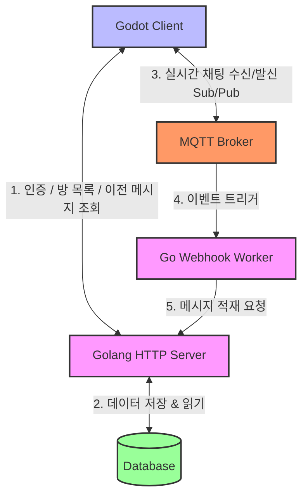

# Flow Chart

```mermaid
flowchart TD
    %% 스타일 정의 (포스팅용 예쁜 색상)
    classDef server fill:#f9f,stroke:#333,stroke-width:2px;
    classDef client fill:#bbf,stroke:#333,stroke-width:2px;
    classDef broker fill:#f96,stroke:#333,stroke-width:2px;
    classDef db fill:#9f9,stroke:#333,stroke-width:2px;

    %% 노드 정의
    Client[Godot Client]:::client
    Server[Golang HTTP Server]:::server
    Broker[MQTT Broker]:::broker
    Webhook[Go Webhook Worker]:::server
    DB[(Database)]:::db

    %% HTTP / REST API 흐름
    Client <--> |1. 인증 / 방 목록 / 이전 메시지 조회| Server
    Server <--> |2. 데이터 저장 & 읽기| DB

    %% 실시간 Pub/Sub 흐름
    Client <--> |3. 실시간 채팅 수신/발신 Sub/Pub| Broker
    
    %% 메시지 영속화 (가장 중요한 백엔드 파이프라인)
    Broker --> |4. 이벤트 트리거| Webhook
    Webhook --> |5. 메시지 적재 요청| Server
```